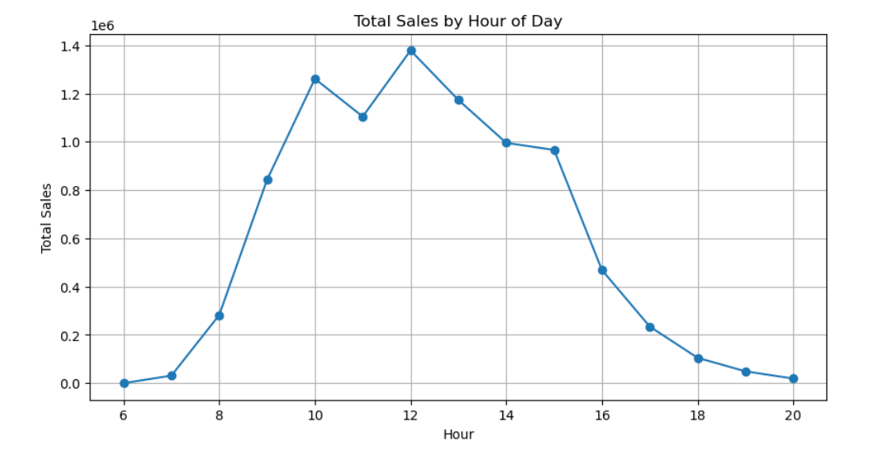
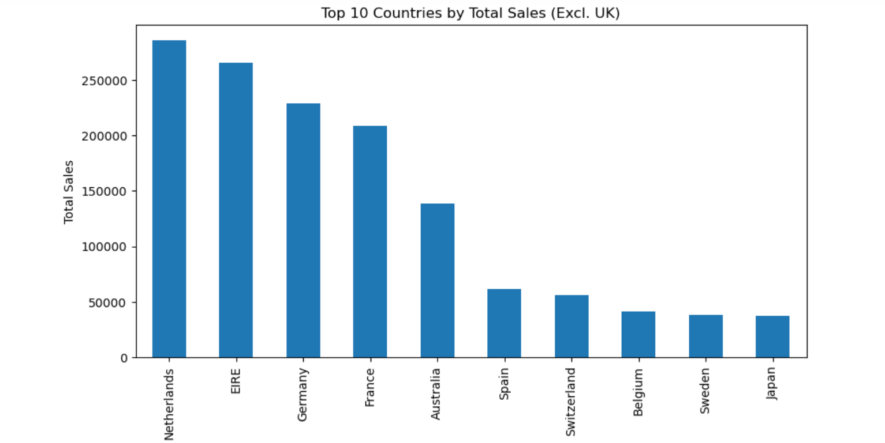
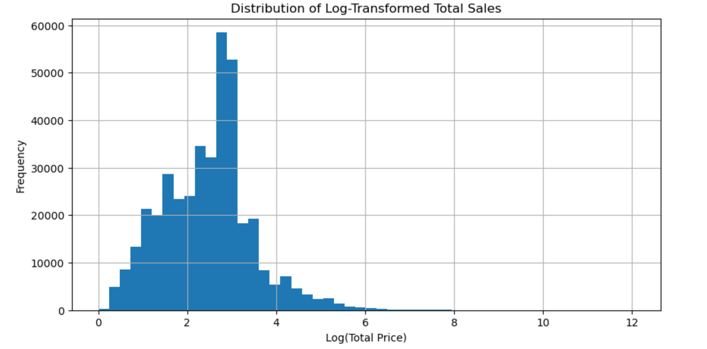

#  Online Retail Sales Analysis (Python | Jupyter Notebook)

Hey! I'm **Major Khaled**, and this project is part of my data science portfolio.  
It's an exploratory data analysis (EDA) on a transactional dataset from an online retailer — aimed at uncovering key patterns in customer behavior, sales trends, and product performance.

---

##  Dataset

The dataset includes over **500,000** transactions made between **2010 and 2011** by customers from various countries.  
Each row represents an item purchased per invoice.

---

##  Tools & Libraries Used

- `pandas` for data manipulation  
- `matplotlib` & `seaborn` for data visualization  
- `datetime` for time-based feature extraction  
- `Jupyter Notebook` for interactive analysis

---

##  Key Steps in Analysis

### 1. Data Cleaning
- Removed missing customer IDs
- Dropped cancelled orders & zero-priced items
- Fixed data types (dates, IDs)

### 2. Feature Engineering
- Added `TotalPrice = Quantity * UnitPrice`
- Extracted: `InvoiceMonth`, `DayOfWeek`, `Hour`

### 3. Customer-Level Analysis
- Top spenders
- Frequency of purchases
- Last purchase dates

### 4. Product & Sales Insights
- Top 10 products by quantity sold
- Sales trends (monthly, daily, hourly)
- Distribution of transaction values

### 5. Country-Level Sales
- Country-wise comparisons (excluding UK)
- Total sales per country

### 6. Correlation Analysis
- Heatmap of quantity, price, and total sales

---

##  Sample Visualizations

### Monthly Sales Trend


### Daily Sales Trend


### Sales by Day & Hour


### Top 10 Products by Quantity


### Total Sales Distribution


### Top Countries by Total Sales


### Correlation Heatmap


---

##  How to Run This Project

To run this notebook locally:

```bash
1. Clone this repository
2. Make sure `online_retail_new.csv` is in the same directory
3. Open the `.ipynb` notebook using Jupyter
4. Run the cells step-by-step to explore the analysis
