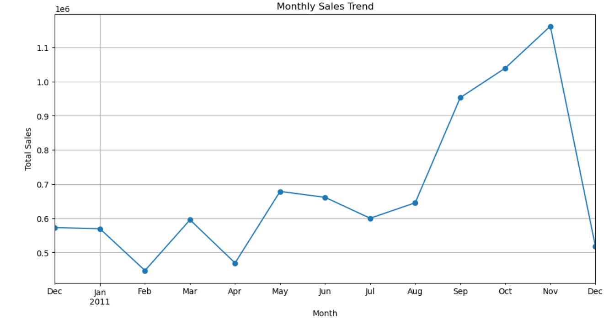
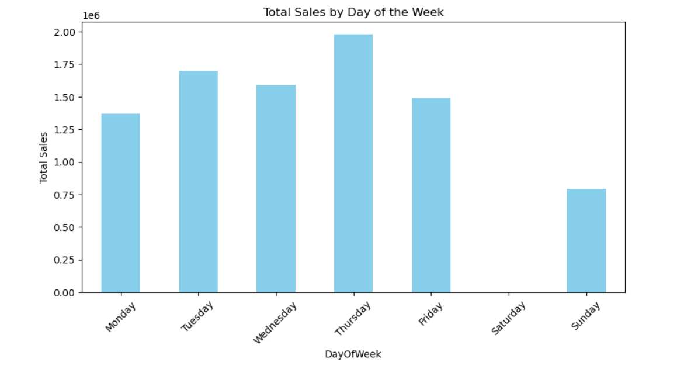
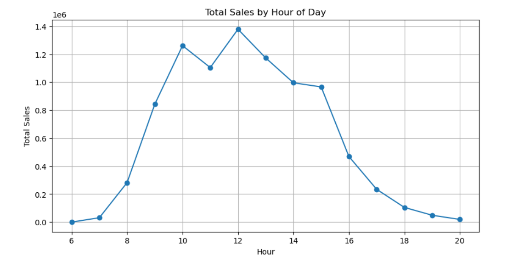
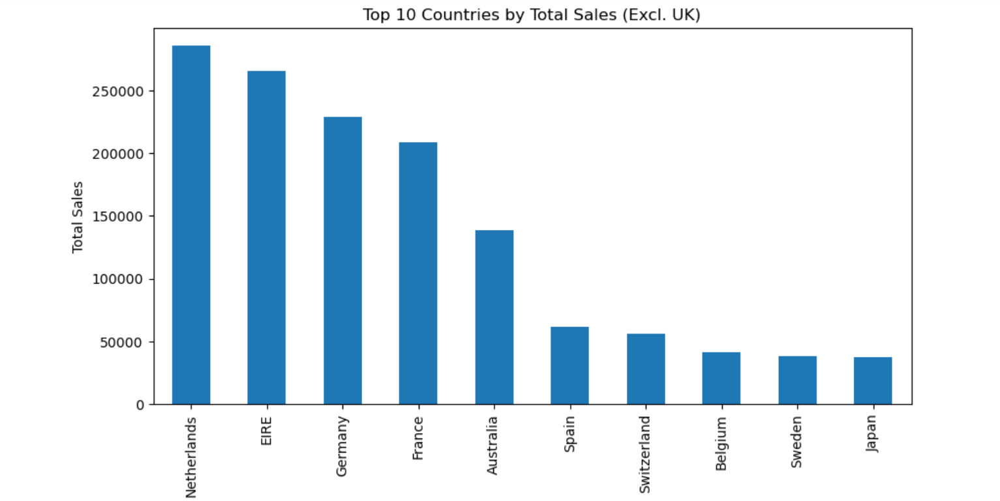
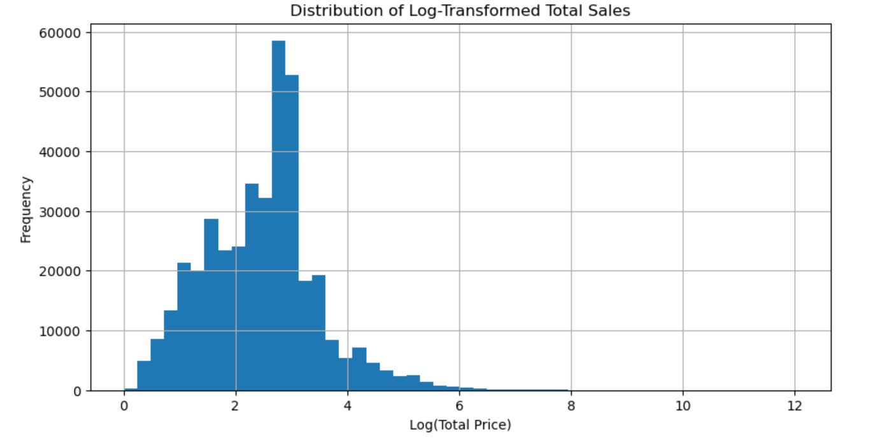
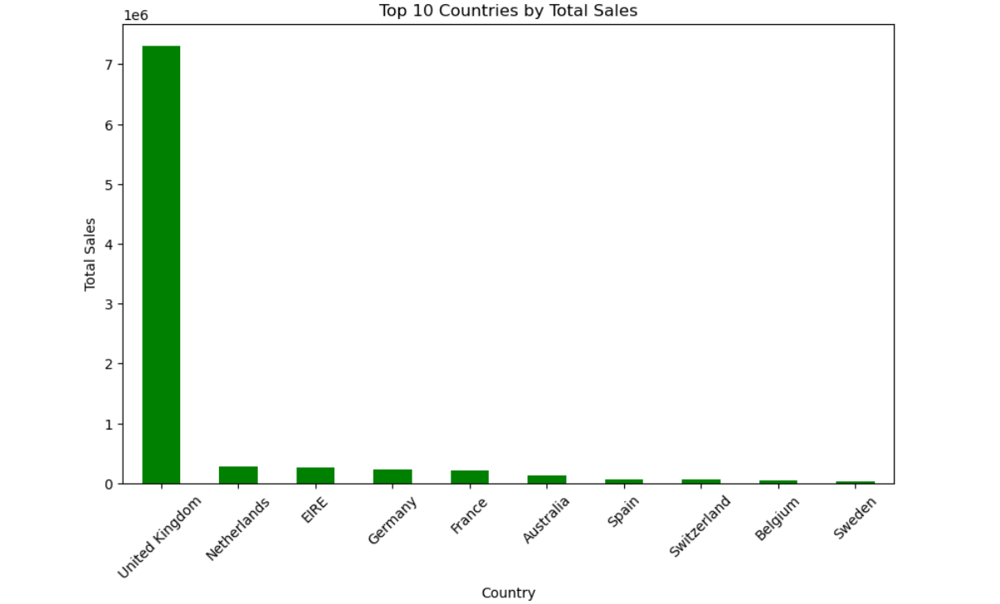
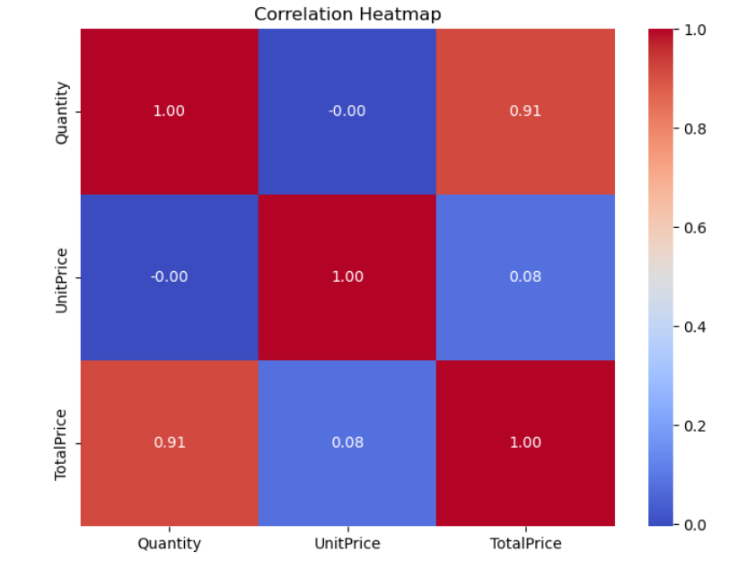

# 🛒 Online Retail Sales Analysis  
**(Python | Jupyter Notebook)**

Hey! I'm **Major Khaled**, and this project is part of my data science portfolio.  
It’s an exploratory data analysis (EDA) project using real-world retail transaction data. The goal is to uncover patterns in **customer behavior**, **sales performance**, and **product trends** to provide actionable business insights.

---

## 📦 Dataset Overview

The dataset contains over **500,000 transactions** from **December 2010 to December 2011**, made by customers across multiple countries.  
Each record reflects one product per invoice, including quantity, unit price, and invoice date.

---

## 🧰 Tools & Libraries

- `pandas` – data cleaning & wrangling  
- `matplotlib` & `seaborn` – visualizations  
- `datetime` – time-based feature extraction  
- `Jupyter Notebook` – step-by-step interactive analysis

---

## 🔎 Analysis Workflow

### 🧹 1. Data Cleaning  
- Removed rows with missing customer IDs  
- Excluded cancelled orders & zero-priced items  
- Converted date fields & fixed data types

### 🧪 2. Feature Engineering  
- Created `TotalPrice = Quantity × UnitPrice`  
- Extracted new features: `InvoiceMonth`, `DayOfWeek`, `Hour`

### 👥 3. Customer Behavior  
- Identified top spending customers  
- Tracked frequency of purchases  
- Analyzed last purchase dates

### 📦 4. Product & Sales Insights  
- Top products by quantity sold  
- Sales trends across time (monthly, daily, hourly)  
- Distribution of total transaction values

### 🌍 5. Country-Level Analysis  
- Sales breakdown by country (excluding UK)  
- Visualized total revenue per country

### 📊 6. Correlation Study  
- Heatmap of numeric features to detect relationships

---

## 📸 Visual Insights  

### 📈 Monthly Sales Trend  
**Shows how sales evolved month-by-month across the year.**  



---

### 📆 Daily Sales Trend  
**Highlights daily sales fluctuations and peak shopping days.**  
🟥 `Add Image: sales_trend_day.png`



---

### ⏰ Sales by Day & Hour  
**Reveals the most active hours and weekdays for transactions.**  



---

### 📦 Top 10 Products by Quantity  
**Displays the ten most sold products based on volume.**  



---

### 💸 Total Sales Distribution  
**Shows distribution of total purchase amounts per invoice.**  



---

### 🌐 Top Countries by Total Sales  
**Visualizes countries with highest total revenue (excluding UK).**  



---

### 🧠 Correlation Heatmap  
**Displays correlation between key numeric features like quantity, unit price, and total price.**  



---

## 🧪 How to Run Locally

```bash
1. Clone this repository
2. Ensure `online_retail_new.csv` is placed in the root directory
3. Open the notebook in Jupyter
4. Run each cell step-by-step
```

---

## ✨ Author

**Major Khaled** — Data Scientist 🚀  
Project built with ❤️ and Python
